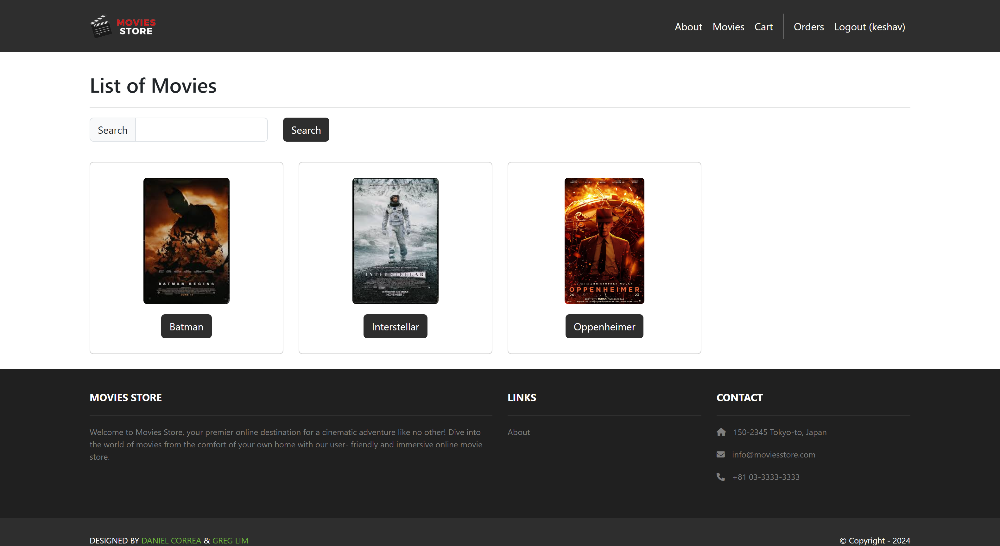
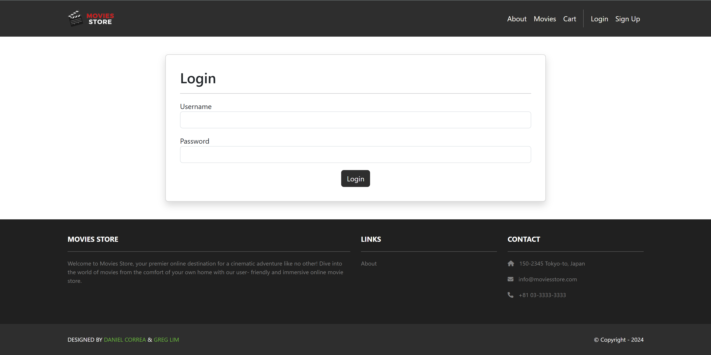
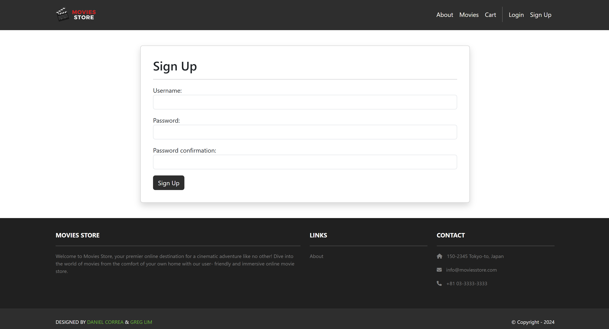

# Movie Store
Movie Store is a simple Django-based online movie storefront and review platform. It provides movie browsing and detail pages, user accounts (signup/login), review creation and editing, a shopping cart with a purchase flow, and an admin interface for managing content.

## Features
- Browse movies and view details

- Create and edit reviews (authenticated users)
- User accounts with signup/login

- Shopping cart and purchase page
- Admin dashboard for content management

## Tech stack
- Python 3.8+
- Django (project uses default SQLite for development)

## Project structure (high level)
- `movies/` — app that provides movie models, views, templates, and reviews
- `accounts/` — user profile, signup/login, account views and templates
- `cart/` — shopping cart, purchase flow, templates and templatetags
- `home/` — simple site pages (home, about)
- `media/movie_images/` — uploaded movie images
- `static/` — static assets (css, images)
- `moviesstore/` — Django project settings, URLs, and WSGI/ASGI

## Engineer
**Keshav Sheth** 
B.S. Computer Engineering @ Georgia Tech '27

