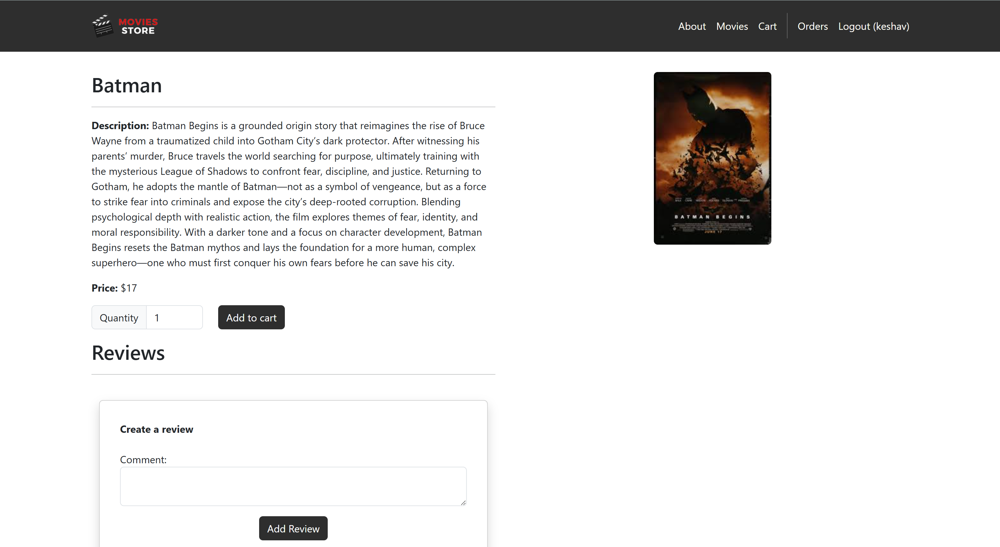
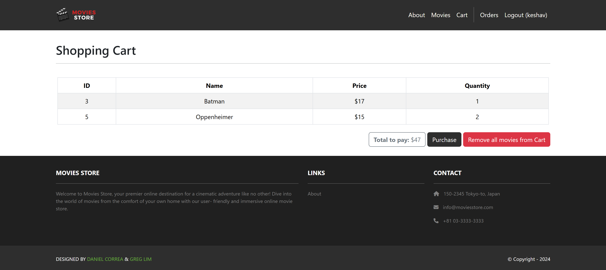
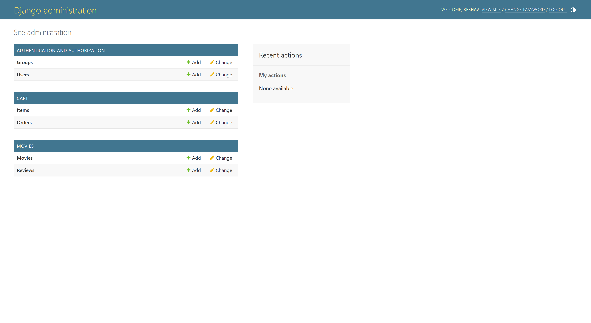

# Movie Store
Movie Store is a simple Django-based online movie storefront and review platform. It provides movie browsing and detail pages, user accounts (signup/login), review creation and editing, a shopping cart with a purchase flow, and an admin interface for managing content.

## Features
- **Browse movies and view details**: A searchable, paginated listing of available movies with thumbnails. Each movie has a dedicated detail page showing synopsis, genre, release date, runtime, rating, available stock, full-size image, and a list of reviews. Detail pages also include an "Add to cart" control (if the item is in stock) and related-movie suggestions.

- **Create, edit and delete reviews (authenticated users)**: Registered users can post reviews on movie pages that include a text body and a numeric rating. Users may edit or delete only their own reviews. Reviews are displayed on movie detail pages, aggregated into an average rating, and can be moderated by admins.

- **User accounts with signup/login and profile**: Email/password signup and login flows with session-based authentication. The `accounts` app provides signup, login, logout, and a user profile page where users can view past orders, manage basic profile info, and see their submitted reviews. Password reset flows can be enabled via Django's built-in auth views.

- **Shopping cart and purchase flow**: Add movies to a persistent cart (session-backed for anonymous users, account-backed for logged-in users). The cart shows line items, quantities, subtotal, and allows updating quantities or removing items. The purchase page simulates checkout (no payment gateway by default) and creates an order record that reduces item stock. Order receipts and history are available on the user's account page.

- **Admin dashboard for content and order management**: Uses Django admin to let site maintainers add/edit movies, manage inventory, view and moderate reviews, and inspect orders. Admins can upload movie images, change prices, and adjust stock counts. The project is ready to integrate admin customizations and additional permissions if needed.

## Tech stack
- Python 3.8+
- Django (project uses default SQLite for development)

## Project structure (high level)
- `movies/` — app that provides movie models, views, templates, and reviews
- `accounts/` — user profile, signup/login, account views and templates
- `cart/` — shopping cart, purchase flow, templates and templatetags
- `home/` — simple site pages (home, about)
- `media/movie_images/` — uploaded movie images
- `static/` — static assets (css, images)
- `moviesstore/` — Django project settings, URLs, and WSGI/ASGI

## Engineer
**Keshav Sheth** 
B.S. Computer Engineering @ Georgia Tech '27

